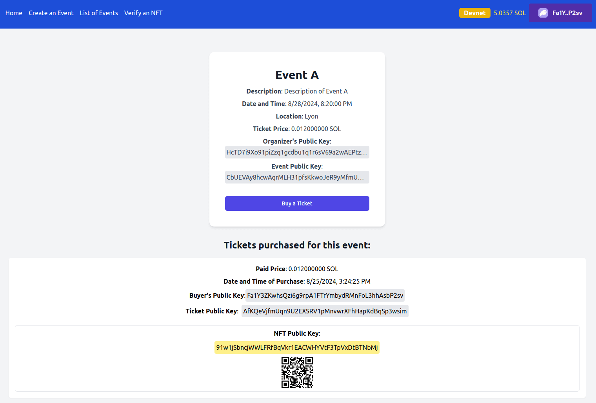

# NFT Ticketing in Rust / Solana / Anchor

<a href="https://github.com/s-damian/anchor-nft-ticketing">

</a>
<a href="https://github.com/s-damian/anchor-nft-ticketing">

</a>
<a href="https://github.com/s-damian/anchor-nft-ticketing">

</a>

> #Rust 🦀 #Solana 💠 #Anchor ⚓ #React ⚛️ #NFT 🖼️ #Web3 🌐

> NFT Marketplace Event Ticketing on the **Solana Blockchain**

[](https://github.com/s-damian/anchor-nft-ticketing/actions/workflows/tests.yml)
[](https://github.com/s-damian/anchor-nft-ticketing/actions/workflows/static-analysis.yml)
[](./LICENSE)

This **NFT Solana Project** is developed by [Stephen Damian](https://github.com/s-damian)

Note: I developed the same project with [Ethereum / Hardhat](https://github.com/s-damian/hardhat-nft-ticketing)


## Summary

- [Project Overview](#project-overview)
- [Roadmap](#roadmap)
- [Various Documentations](#various-documentations)
- [Prerequisites](#prerequisites)
- [Technologies](#technologies)
- [Getting Started (Localnet)](#getting-started-localnet)
- [Transition: Localnet to Devnet](#transition-localnet-to-devnet)
- [Code Structure](#code-structure)
- [License](#license)


## Project Overview

NFT Marketplace Event Ticketing - A decentralized application for managing and verifying event tickets as NFTs on the Solana blockchain.

**Status**: Under development 🚧



See more images here:
[Images](./img/)


## Roadmap

- [x] Phantom integration.
- [x] Homepage.
- [x] Create event.
- [x] Event listing.
- [x] Buy a ticket.
- [x] Generate NFTs.
- [x] Verify NFTs.
- [ ] Integrate other wallets.
- [ ] Event organizer dashboard.


## Various Documentations

- To switch from the **Localnet** to **Devnet**:
[Localnet-to-Devnet.md](./docs/Localnet-to-Devnet.md)

- See further technical details here:
[Notes-tech.md](./docs/Notes-tech.md)


## Prerequisites

- **Rust** `>= 1.75.0` (last tested: `1.80.0`) - *You can install Rust here: [Rustup](https://rustup.rs/).*
- **Solana** `>= 1.18.14` (last tested: `1.18.22`) - *You can install Solana CLI here: [Solana CLI](https://solana.com/developers/guides/getstarted/setup-local-development#3-install-the-solana-cli).*
- **Anchor** `0.30.1` - *You can install Anchor here: [Anchor](https://www.anchor-lang.com/).*
- **Node.js** `>= 18` (last tested: `20`) and **npm** - *You can install Node.js and npm here: [Node.js](https://nodejs.org/en/download/package-manager).*


## Technologies

- **Back-End**: Rust, Solana, Anchor `0.30.1`
- **Front-End**: Next.js `14`, React `18`, TypeScript `5`, Tailwind CSS
- **Blockchain Interaction**: Solana-Web3.js
- **Wallet Integration**: Phantom


## Getting Started (Localnet)

### Setup Solana Locally

Configure your Solana CLI to use your localhost validator:

```bash
solana config set --url localhost
```


### Clone the Repository

```bash
git clone https://github.com/s-damian/anchor-nft-ticketing.git
```


### Go to the Anchor Directory

```bash
cd /<your-path>/anchor-nft-ticketing
```


### Install Dependencies

For the Anchor Program:

```bash
npm install
```

For the Next.js App:

```bash
npm install --prefix ./app/frontend
```


### Update Anchor Configuration

- In `[provider]` section, update to:

```bash
[provider]
cluster = "localnet"
```


### Environment Setup

Create a  `./app/frontend/.env` file (for the Next.js App):

```bash
cp ./app/frontend/.env.example ./app/frontend/.env
```


### Make Scripts Executable

Ensure that the shell scripts are executable:

```bash
chmod +x sh/*.sh
```


### Run Solana Local Validator

Start the Solana local validator (solana-test-validator) with Metaplex:

```bash
npm run ledger
```


### Fund Your Wallet

After starting the Solana local validator, you will probably need to airdrop SOL to your Localnet wallet:

```bash
solana airdrop <amount>
```


### Build and Deploy the Anchor Program

Build:

```bash
anchor build
```

Deploy:

```bash
anchor deploy
```

> **PS**: `anchor deploy` will create your `target/idl/nft_ticketing.json` file.


### Update Program ID

Automatically update the Program ID in the necessary files:

```bash
npm run update-program-id
```


### Rebuild and Redeploy the Anchor Program

```bash
anchor build && anchor deploy
```

> This step is crucial after updating the Program ID to ensure that the deployed program matches the updated configuration.


### IDL Setup

Copy the IDL (Interface Definition Language) file into the Next.js App:

```bash
npm run copy-idl
```


### Phantom Wallet

In your Phantom wallet settings, switch to **Solana Localnet**.


### Run Front-End (Next.js App)

Go to the Next.js App Directory:

```bash
cd /<your-path>/anchor-nft-ticketing/app/frontend
```

Start the development server:

```bash
npm run dev
```

Open your browser and go to:

```bash
http://localhost:3000
```


## Transition: Localnet to Devnet

*Preparing for Public Deployment: Transition from Localnet to Devnet*

After successfully running your project locally, the next step is to deploy it on the public Devnet. This section guides you through the process of configuring your environment, deploying your program to Devnet, and updating your Front-End to interact with the deployed program on the Devnet.

To switch from the **Localnet** to **Devnet**: [Localnet-to-Devnet.md](./docs/Localnet-to-Devnet.md)


## Code Structure

```bash
.
├── app
│   └── frontend
│       ├── app
│       │   └── [React pages]
│       ├── src
│       │   ├── components
│       │   │   └── [React components]
│       │   ├── handlers
│       │   │   └── [React handlers]
│       │   ├── idl
│       │   │   └── nft_ticketing.json.
│       │   └── utils
│       │       └── [React utils]
│       ├── .env
│       ├── config-overrides.js
│       ├── package.json
│       └── tailwind.config.ts
├── programs
│   └── nft-ticketing
│       ├── src
│       │   ├── kernel
│       │   │   └── [Program managers]
│       │   └── lib.rs
│       └── Cargo.toml
├── tests
│   └── [Tests]
├── Anchor.toml
├── Cargo.toml
├── package.json
└── README.md
```


## License

This project is licensed under the MIT License. See the [LICENSE](./LICENSE) file for more details.
