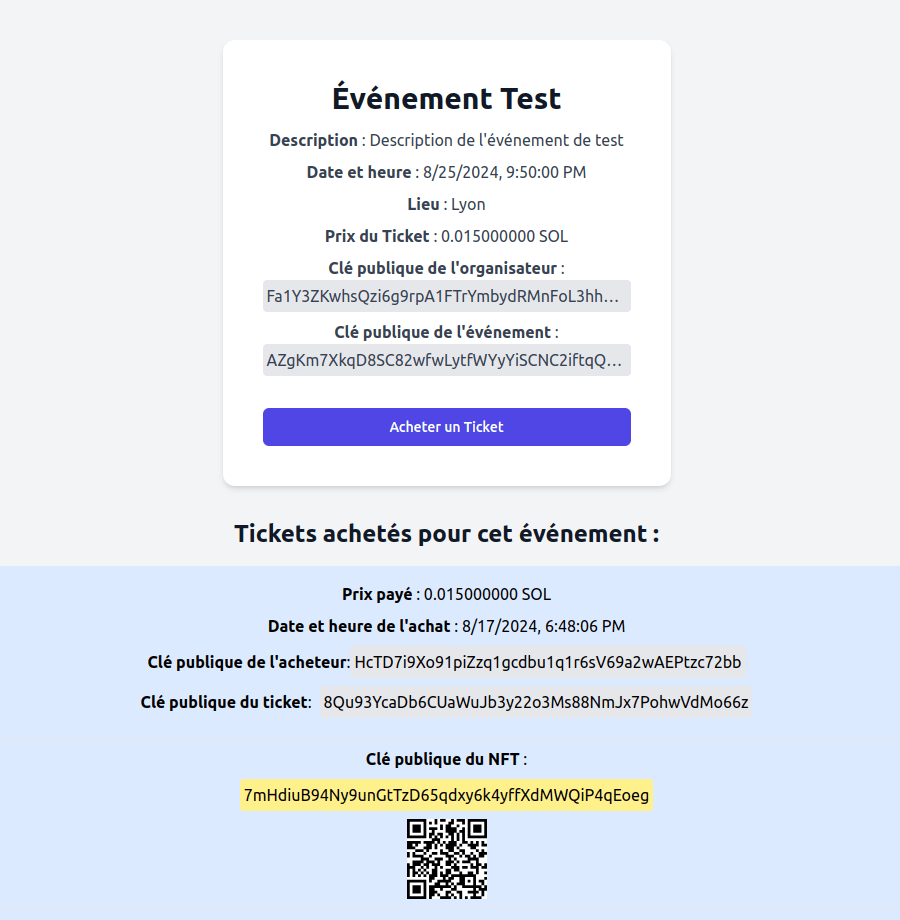

# NFT Ticketing in Solana / Anchor / Rust

<a href="https://github.com/s-damian/anchor-nft-ticketing">

</a>
<a href="https://github.com/s-damian/anchor-nft-ticketing">

</a>
<a href="https://github.com/s-damian/anchor-nft-ticketing">

</a>

> #Rust #Solana #Anchor #React #NFT # Web3

> NFT Marketplace Event Ticketing on the Solana Blockchain


This **NFT Solana Project** is developed by [Stephen Damian](https://github.com/s-damian)

PS: I developed the same project with [Ethereum / Hardhat](https://github.com/s-damian/hardhat-nft-ticketing)


## Project Overview

NFT Marketplace Event Ticketing - A decentralized application for managing and verifying event tickets as NFTs on the Solana blockchain.

**Status**: Under development 🚧




## Prerequisites

- **Rust** ```>= 1.75.0``` | *You can install Rust here: [Rustup](https://rustup.rs/).*
- **Solana** ```1.18.22``` | *You can install Solana CLI here: [Solana CLI](https://solana.com/developers/guides/getstarted/setup-local-development#3-install-the-solana-cli).*
- **Anchor** ```0.30.1``` | *You can install Anchor here: [Anchor](https://www.anchor-lang.com/).*
- **Node.js** ```>= 18``` and **npm** | *You can install Node.js and npm here: [Node.js](https://nodejs.org/en/download/package-manager).*


## Technologies

- **Back-End**: Rust, Solana, Anchor ```0.30.1```
- **Front-End**: Next.js ```14```, React ```18```, TypeScript, Tailwind CSS
- **Wallet Integration**: Phantom Wallet
- **Blockchain Interaction**: Solana-Web3.js


## Getting Started

### Clone the Repository

```bash
git clone https://github.com/s-damian/anchor-nft-ticketing.git
```

### Setup Solana Locally

Set Solana to run on the local network:

```bash
solana config set --url localhost
```

### Install Dependencies

For the Anchor Program:

```bash
cd /[your-path]/anchor-nft-ticketing
```

```bash
npm install
```

For the Next.js App:

```bash
cd /[your-path]/anchor-nft-ticketing/app/front
```

```bash
npm install
```

### Environment Setup

Create a  ```.env ``` file for the Next.js app:

```bash
cd /[your-path]/anchor-nft-ticketing/app/front
```

```bash
cp .env.example .env
```

### Run Solana Test Validator

Start the Solana test validator with Metaplex:

```bash
npm run ledger
```

### Build and Deploy the Anchor Program

```bash
anchor build && anchor deploy
```

### IDL Setup

Copy the IDL (Interface Definition Language) file:

```bash
cd /[your-path]/anchor-nft-ticketing
```

```bash
./sh/copy-idl.sh
```

### Change Program ID

In the file :

```bash
target/idl/nft_ticketing.json
```

1/3. Find your program ID in ```target/idl/nft_ticketing.json```.

2/3. Update the program ID in:
- Anchor.toml
- programs/nft-ticketing/src/lib.rs

3/3. Rebuild and redeploy:

```bash
anchor build && anchor deploy
```

### Run Front-End (Next.js App):

```bash
cd /[your-path]/anchor-nft-ticketing/app/front
```

```bash
npm run dev
```


## Code Structure

```bash
.
├── app
│   └── front
│       ├── app
│       │   // Pages (Nextjs App Router).
│       ├── src
│       │   ├── components
│       │   │   // React components.
│       │   ├── handlers
│       │   │   // React handlers.
│       │   ├── idl
│       │   │   └── nft_ticketing.json.
│       │   └── utils
│       │       // React utils.
│       ├── .env.local
│       ├── config-overrides.js
│       ├── package.json
│       └── tailwind.config.ts
├── programs
│   └── nft-ticketing
│       ├── src
│       │   ├── kernel
│       │   │   // Program managers.
│       │   └── lib.rs
│       └── Cargo.toml
├── tests
│   └── tests.ts
├── Anchor.toml
├── Cargo.toml
├── package.json
└── README.md
```


## License

This project is licensed under the MIT License. See the [LICENSE](LICENSE) file for more details.
